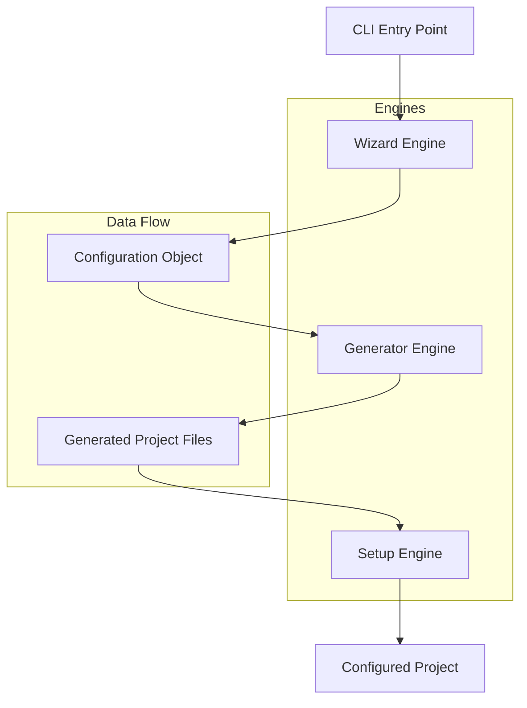

# Technical Specification for create-lazorkit-app CLI

## Overview

create-lazorkit-app is a command-line tool designed to scaffold new applications integrated with the Lazorkit SDK. It provides an interactive way to set up projects for various frameworks including Next.js, Vite, and React Native. The tool assumes a generic SDK integration pattern, using placeholder configurations that can be customized once SDK details are available.

## Architecture Overview

The CLI architecture is centered around three main engines that work sequentially to create a fully configured project:

1. **Wizard Engine**: Manages user interaction and collects project configuration data through interactive prompts.
2. **Generator Engine**: Processes template files and generates the actual project structure with Lazorkit SDK integration.
3. **Setup Engine**: Handles dependency installation and post-generation configuration tasks.

## Engines Details

### Wizard Engine

The Wizard Engine is responsible for collecting all necessary information from the user to configure the new application.

**Key Features:**
- Interactive prompts using a library like `inquirer.js`
- Input validation for app names, framework choices, and feature selections
- Support for the following frameworks:
  - Next.js (React-based web framework)
  - Vite (fast build tool for modern web projects)
  - React Native (mobile app framework)
- Feature selection (e.g., TypeScript support, testing frameworks, UI libraries)
- Output: A structured configuration object containing all user inputs

**Responsibilities:**
- Prompt for application name (with validation)
- Present framework options with descriptions
- Allow selection of optional features
- Confirm selections before proceeding

### Generator Engine

The Generator Engine takes the configuration from the Wizard and uses it to scaffold the project from predefined templates.

**Key Features:**
- Template-based code generation using Handlebars or similar templating engine
- Framework-specific template directories
- Generic Lazorkit SDK integration:
  - Adds SDK import statements
  - Includes placeholder configuration files
  - Generates basic usage examples
- File copying and content replacement
- Directory structure creation

**Template Structure:**
- Base templates for each framework
- Feature-specific template additions
- SDK integration templates (generic placeholders)

### Setup Engine

The Setup Engine handles the final configuration and setup of the generated project.

**Key Features:**
- Automatic dependency installation (npm/yarn/pnpm)
- Framework-specific initialization commands
- Lazorkit SDK configuration setup
- Environment file creation with placeholders
- Post-installation scripts execution

**Configuration Tasks:**
- Install project dependencies
- Run framework-specific setup (e.g., `npx next telemetry disable`)
- Generate `.env` files with Lazorkit API key placeholders
- Initialize git repository if requested

## Component Diagram



## Data Flow

The data flow through the CLI follows a linear pipeline:

1. **Initialization**: User executes `npx create-lazorkit-app` or similar command
2. **Wizard Phase**: 
   - Wizard Engine prompts user for inputs
   - Validates and structures data into configuration object
   - Passes config to Generator Engine
3. **Generation Phase**:
   - Generator Engine receives config object
   - Selects appropriate templates based on framework choice
   - Processes templates with config data
   - Generates complete project structure
   - Passes generated files to Setup Engine
4. **Setup Phase**:
   - Setup Engine receives generated project path
   - Installs dependencies using detected package manager
   - Runs framework-specific configuration commands
   - Sets up Lazorkit SDK with placeholder configurations
   - Provides user with next steps

**Error Handling**: Each engine includes error handling that can rollback to previous steps if needed.

## File Structure

The CLI tool itself follows a modular structure:

```
create-lazorkit-app/
├── bin/
│   └── cli.js                 # Main CLI entry point
├── lib/
│   ├── engines/
│   │   ├── wizard.js          # Wizard Engine implementation
│   │   ├── generator.js       # Generator Engine implementation
│   │   └── setup.js           # Setup Engine implementation
│   ├── utils/
│   │   ├── validators.js      # Input validation utilities
│   │   ├── file-utils.js      # File system operations
│   │   └── package-managers.js # Package manager detection and commands
│   └── config/
│       └── defaults.js        # Default configurations and constants
├── templates/
│   ├── base/                  # Common template files
│   ├── nextjs/                # Next.js specific templates
│   │   ├── app/               # App router templates
│   │   ├── pages/             # Pages router templates
│   │   └── components/        # Component templates
│   ├── vite/                  # Vite specific templates
│   │   ├── react/             # React templates
│   │   └── vanilla/           # Vanilla JS templates
│   └── react-native/          # React Native templates
│       ├── components/        # Component templates
│       └── screens/           # Screen templates
├── package.json               # CLI package configuration
├── README.md                  # Usage documentation
└── .gitignore                 # Git ignore for CLI development
```

**Template Organization:**
- Templates use Handlebars syntax for variable substitution
- Framework-specific directories contain starter files
- SDK integration templates are stored in `templates/base/sdk/`
- Feature templates are modular and can be combined

## Implementation Considerations

- **Language**: Node.js with ES modules
- **Dependencies**: inquirer, handlebars, fs-extra, chalk
- **Testing**: Jest for unit tests, integration tests for full pipeline
- **Error Handling**: Graceful error messages with recovery options
- **Extensibility**: Plugin system for additional frameworks or features
- **SDK Integration**: Generic placeholders that can be updated when SDK specs are available

## Future Enhancements

- Support for additional frameworks (Vue, Svelte, etc.)
- Custom template support
- CI/CD pipeline integration
- Plugin ecosystem for third-party integrations
